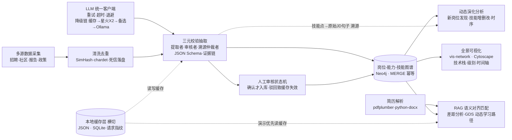

# 🧠 多源异构数据驱动的岗位与能力图谱构建及动态演化分析

> 挑战杯 · 揭榜挂帅赛题 ｜ 让岗位画像从「静态描述」走向「动态感知」


---

## 📌 项目简介

本项目面向 IT 行业岗位能力快速迭代的痛点，融合**多源异构数据采集、大语言模型三元校验、知识图谱**三大技术，并以**本地缓存横切 + 三级降级**保证工程可演示，构建一套「岗位—能力—技能」全景图谱系统，实现：

- 🔍 **新岗位自动发现**：识别萌芽 / 新兴岗位并生成标准定义
- 🔄 **能力动态演化**：追踪既有岗位技能的增 / 删 / 改，并**溯源到原始 JD 句子**
- 🕸️ **全景图谱可视化**：技能点级粒度，支持按技术栈 / 级别交互切换
- 🎯 **人岗匹配诊断**：简历解析 + RAG 语义对齐差距分析 + 动态学习路径推荐

<!-- 项目跑起来后，把系统截图放这里，效果立竿见影 -->
<!--  -->

## 🏗️ 系统架构



## ✨ 核心亮点

| 亮点 | 说明 |
|------|------|
| 🛡️ 三元校验证据链 | 提取者—审核者—溯源仲裁者三 Agent 互校，每个技能点挂原始 JD 证据句，无证据一票否决，从根上防幻觉 |
| 💾 缓存横切 + 三级降级 | 所有 LLM 结果写本地缓存；API 不可用按 缓存 → 星火 X2 → 备选模型 → Ollama 本地 逐级降级，保证现场可演示 |
| 🤝 人机协同审核 | AI 生成的岗位定义 / 能力更新经人工确认才入库，驳回自动失效旧缓存，留修改 / 驳回日志 |
| ⏱️ 动态演化感知 | 聚类 + 时序对比识别新兴岗位与技能增删改，让画像从「静态描述」走向「动态感知」 |
| 🎯 RAG 对齐匹配 + 动态路径 | 简历技能与图谱标准技能语义对齐给量化差距；Neo4j GDS 综合学习成本 / 前置依赖规划路径 |

## 🧰 技术栈

- **数据采集**：Scrapy / Playwright / Pandas / SimHash / chardet
- **智能抽取**：讯飞星火 X2（基座）/ DeepSeek / Qwen（比对）/ Ollama + Qwen2.5‑7B（本地兜底）/ LangChain / JSON Schema
- **语义匹配**：RAG / Milvus / 向量语义对齐
- **知识存储**：Neo4j（含 GDS 路径算法）/ PostgreSQL / Redis
- **本地缓存**：JSON / SQLite（请求指纹 hash）
- **后端服务**：FastAPI / OpenAPI（Swagger）
- **前端可视化**：React / vis‑network / Cytoscape.js / ECharts / D3.js
- **简历解析**：pdfplumber / python‑docx（扫描件 OCR 兜底）
- **测试与质量**：pytest / pytest‑cov / 固定随机种子 / ruff
- **部署与 CI**：Docker / docker‑compose / GitHub Actions

## 📂 目录结构

```
job-skill-graph-evolution/
├── backend/
│   ├── app/
│   │   ├── api/          # FastAPI 路由，挂 Swagger(/docs)
│   │   ├── agents/       # 提取者 / 审核者 / 溯源仲裁者 三 Agent
│   │   ├── llm/          # 统一客户端：重试·超时·退避·降级链
│   │   ├── cache/        # 本地缓存 + 请求指纹（横切层）
│   │   ├── extract/      # 抽取 + JSON Schema 校验 + 非JSON剥离
│   │   ├── graph/        # Neo4j MERGE / 索引 / 演化分析
│   │   ├── review/       # 人工审核状态机 + 日志 + 驳回致缓存失效
│   │   ├── match/        # 简历解析 + RAG 语义对齐匹配
│   │   └── path/         # Neo4j GDS 动态路径 + DAG 校验
│   ├── prompts/          # Prompt 模板入仓（不依赖 Dify 运行时）
│   ├── tests/
│   │   ├── conftest.py   # 固定随机种子
│   │   ├── unit/         # 三大准确率参数化用例（目标 ≥ 90%）
│   │   └── integration/  # 全链路 + 性能基线 < 5s
│   ├── Dockerfile        # 多阶段，含前端构建产物
│   └── requirements.txt  # 锁版本
├── frontend/             # React + vis-network / Cytoscape.js
│   ├── src/
│   ├── package-lock.json # 锁版本
│   └── Dockerfile
├── data/                 # 数据 / 缓存 / 快照 / 死信（不入库，见 .gitignore）
│   ├── cache/            # LLM 缓存
│   ├── demo_snapshot/    # 演示独立快照
│   ├── dead_letter/      # 乱码 / 解析失败落盘
│   ├── failed_urls/      # 爬虫失败 URL 落盘
│   └── raw/              # Kaggle 原始数据
├── docs/
│   ├── openapi.yaml      # Day1 接口骨架
│   └── screenshots/
├── .github/workflows/
│   └── ci.yml            # lint + 单测 + 覆盖率门禁 + 构建镜像
├── .env.example          # 密钥 / 端口模板（不含真实密钥）
├── .gitignore
├── docker-compose.yml    # Neo4j + FastAPI + 前端 一次写全
├── LICENSE
└── README.md

```

## 🚀 快速开始

```bash
# 1. 克隆仓库
git clone https://github.com/Crystal-yyl/job-skill-graph-evolution.git
cd job-skill-graph-evolution

# 2. 配置环境变量（真实 .env 绝不提交，若误提交 key 立即去平台轮换）
cp .env.example .env   # 填入 API Key / 数据库配置 / 端口

# —— 方式 A：Docker 一键起（推荐，呼应“容器化从 Day1 写入”）——
docker compose up --build   # 同时拉起 Neo4j + 后端 + 前端

# —— 方式 B：本地手动起（开发调试用）——
python -m venv venv
venv\Scripts\activate            # macOS/Linux: source venv/bin/activate
pip install -r requirements.txt  # 前端另见 frontend/ 的 npm install
uvicorn backend.app.api.main:app --reload

```

> ⚠️ 项目仍在开发中：`requirements.txt`、`.env.example`、`docker-compose.yml` 与各代码目录随**阶段 1** 落地，上述命令为占位示例，跑通后会同步回填真实命令。

## 🗺️ 开发路线（与 `docs` 进度表同步，完成即勾）

- [x] 仓库初始化与 README 设计图对齐最终方案
- [ ] **阶段 1** 工程基建：仓库规范 / OpenAPI 骨架 / 测试管线 / 容器化 CI
- [ ] **阶段 2** 数据获取、清洗去重与本地缓存横切层
- [ ] **阶段 3** 三元校验抽取引擎（提取者·审核者·溯源仲裁者）与降级链
- [ ] **阶段 4** 图谱入库、演化分析与人工审核状态机
- [ ] **阶段 5** 前后端分离、图谱交互、RAG 匹配与动态学习路径
- [ ] **阶段 6** 三级降级演练、集成测试（< 5s）、演示视频与交付物

> 质量门禁：三大业务准确率（JD 解析 / 简历提取 / 人岗匹配）参数化用例目标 **≥ 90%**；代码覆盖率设 CI 门禁；核心演示场景响应 **< 5s**。

## 👥 团队

| 成员 | 分工 |
|------|------|
| （你的名字） | 总体设计 / 图谱与匹配 |
| （队友名字） | 数据采集 / 前端可视化 |
<!-- 按实际增减行数 -->

> 协作机制：指定**一人专职测试**；每人认领一个独立可测模块并设内部 deadline；每周 2 次 15 分钟站会；以**第 7 天 MVP 闭环、第 14 天集成冻结**为两条生死线。

## 📄 许可证

本项目基于 [MIT License](LICENSE) 开源。

---

<p align="center">Made with ❤️ for 挑战杯 · 揭榜挂帅</p>
