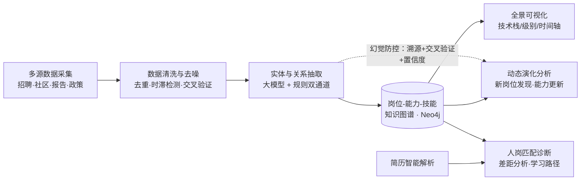

# 🧠 多源异构数据驱动的岗位与能力图谱构建及动态演化分析

> 挑战杯 · 揭榜挂帅赛题 ｜ 让岗位画像从「静态描述」走向「动态感知」


---

## 📌 项目简介

本项目面向 IT 行业岗位能力快速迭代的痛点，融合**多源异构数据采集、大语言模型、知识图谱**三大技术，构建一套「岗位—能力—技能」全景图谱系统，实现：

- 🔍 **新岗位自动发现**：识别萌芽/新兴岗位并生成标准定义
- 🔄 **能力动态演化**：追踪既有岗位技能的增 / 删 / 改，并溯源数据
- 🕸️ **全景图谱可视化**：技能点级粒度，支持按技术栈 / 级别交互切换
- 🎯 **人岗匹配诊断**：简历解析 + 差距分析 + 学习路径推荐

<!-- 项目跑起来后，把系统截图放这里，效果立竿见影 -->
<!--  -->

## 🏗️ 系统架构



## ✨ 核心亮点

| 亮点 | 说明 |
|------|------|
| 🛡️ 幻觉防控机制 | 大模型输出 → RAG 溯源核验 → 置信度打分 → 低置信进人工审核队列 |
| 🔀 多源交叉验证 | 同一岗位多平台数据对比，剔除「通胀技能」与「抄袭 JD」 |
| ⏱️ 时滞感知 | 基于发布时间与内容新鲜度，识别过时能力项 |
| 🤖 多模型协同 | Claude 把关架构、DeepSeek/千问处理中文 NLP、Codex 加速编码 |

## 🧰 技术栈

- **数据采集**：Scrapy / Playwright / Pandas / SimHash
- **智能处理**：LangChain / LlamaIndex / BERTopic / SpaCy
- **知识存储**：Neo4j / Milvus / PostgreSQL / Redis
- **后端服务**：FastAPI
- **前端可视化**：React / Vue3 / AntV G6 / ECharts / D3.js
- **部署**：Docker / GitHub Actions

## 📂 目录结构

```
job-skill-graph-evolution/
├── data/                # 数据（仅提交 sample/，全量已 gitignore）
│   └── sample/
├── src/
│   ├── crawler/         # 多源数据采集
│   ├── nlp/             # 实体 / 关系抽取
│   ├── graph/           # 图谱构建与动态演化
│   └── match/           # 简历解析与人岗匹配
├── web/                 # 前端可视化
├── tests/               # 测试用例（目标覆盖率 ≥ 60%）
├── docs/                # 方案文档 / PPT / 截图
├── .env.example         # 密钥模板（不含真实密钥）
├── .gitignore
├── LICENSE
└── README.md

```

## 🚀 快速开始

```bash
# 1. 克隆仓库
git clone https://github.com/Crystal-yyl/job-skill-graph-evolution.git
cd job-skill-graph-evolution

# 2. 配置环境变量
cp .env.example .env   # 然后填入你的 API Key / 数据库配置

# 3. 安装依赖（后端）
python -m venv venv
source venv/bin/activate      # Windows: venv\Scripts\activate
pip install -r requirements.txt

# 4. 启动服务
uvicorn src.api.main:app --reload   # 命令以实际为准

```

> ⚠️ 项目仍在开发中，上述命令为占位示例，跑通后会同步更新。

## 🗺️ 开发路线

- [x] 仓库初始化与目录骨架
- [ ] 多源数据采集与清洗
- [ ] 知识图谱本体设计与构建
- [ ] 新岗位发现 & 能力动态更新
- [ ] 全景图谱可视化
- [ ] 简历解析与人岗匹配
- [ ] 系统集成、测试与部署
- [ ] 方案文档 / PPT / 演示视频

## 👥 团队

| 成员 | 分工 |
|------|------|
| （你的名字） | 总体设计 / 图谱与匹配 |
| （队友名字） | 数据采集 / 前端可视化 |
<!-- 按实际增减行数 -->

## 📄 许可证

本项目基于 [MIT License](LICENSE) 开源。

---

<p align="center">Made with ❤️ for 挑战杯 · 揭榜挂帅</p>
